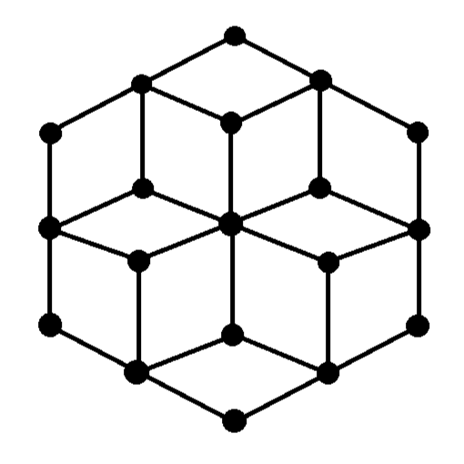

# Welcome to Project Hexagon!
 
Project Hexagon features a hexagonal graph model, one that is expandable via attachments, through which various patterns can be traced alongside the edges with the LED strips attached to them. Use the simulation interface below to see for yourself what this model can do!
 

  

 
Let's delve deeper into the project and understand it's execution!
 
<iframe  width="100%" height="500" src="https://www.youtube.com/embed/fhsjhfgjgf" title="YouTube video player" frameborder="0" allow="accelerometer; autoplay; clipboard-write; encrypted-media; gyroscope; picture-in-picture" allowfullscreen></iframe>
 
The purpose of this site is to allow you to understand how the project functions and was designed, equipping you with everything required to do this yourself. Let's get started!