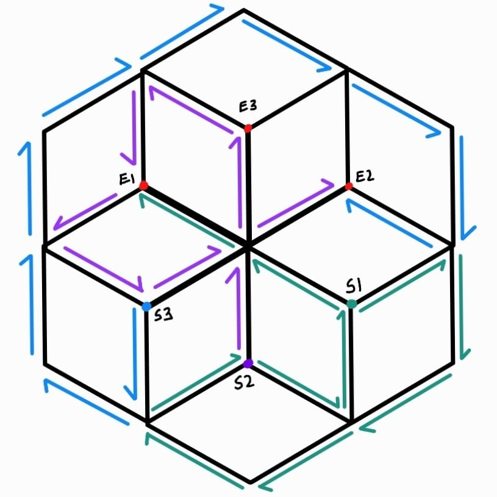

# How does it work?
 

Let us begin to understand how the Hexagon model works to display the patterns demonstarted, and in order to do so, it is important to understand the hardware structure of the model.

### The Build

  

One hexagon incorporates three paths that are connected to communicate such that there are no overlaps when traversing through the whole structure, labelled as S1, S2, and S3 in the diagram given above. These paths receive instructions from an ESP32 which is mounted on the bottom node of the graph (vertical edge close to E3), and as such, the starting points (labelled as E1, E2, and E3) are present close to the node with the ESP.

### Configurations
Necessary configurations.

### Commands
Necessary commands.

### Pattern Display
How the pattern is displayed

### Functional Block Diagram
The block diagram for explaining it graphically